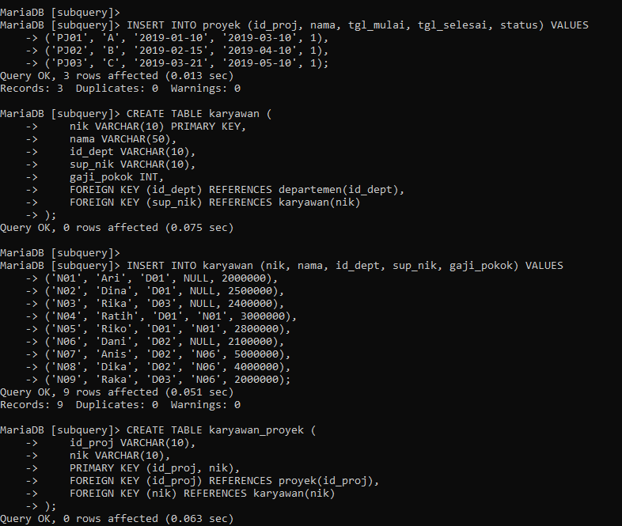
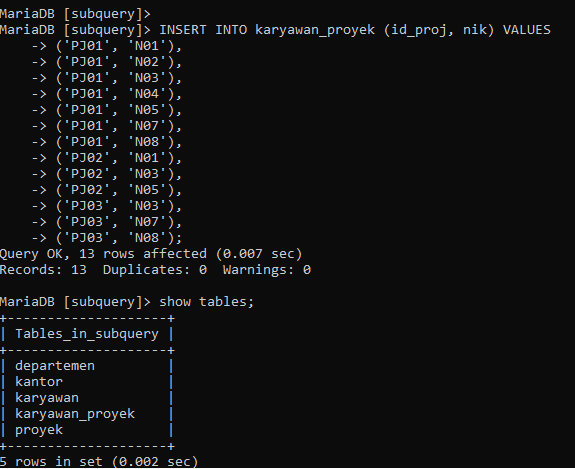

# MYSQL7 - Pertemuan ke 15
# Tugas Praktikum6 { Pertemuan ke 14 } 


|**Nama**|**NIM**|**Kelas**|**Matkul**|
|----|---|-----|------|
|Rafflianda Barus|312310477|TI.23.A.5|Basis Data|

# TABEL


### Latihan
1. **Tampilkan data karyawan yang bekerja pada departemen yang sama dengan karyawan yang bernama Dika.**

   ```sql
   SELECT
       nik,
       nama,
       id_dept,
       sup_nik,
       gaji_pokok
   FROM karyawan
   WHERE id_dept = (
       SELECT id_dept FROM karyawan
       WHERE nama = 'Dika'
   );
   ```

.PNG>)

2. **Tampilkan data karyawan yang gajinya lebih besar dari rata-rata gaji semua karyawan. Urutkan menurun berdasarkan besaran gaji.**

   ```sql
   SELECT
       nik,
       nama,
       id_dept,
       sup_nik,
       gaji_pokok
   FROM karyawan
   WHERE gaji_pokok > (
       SELECT AVG(gaji_pokok) FROM karyawan
   )
   ORDER BY gaji_pokok DESC;
   ```

.PNG>)

3. **Tampilkan nik dan nama karyawan untuk semua karyawan yang bekerja di departemen yang sama dengan karyawan dengan nama yang mengandung huruf 'K'.**

   ```sql
   SELECT
       nik,
       nama
   FROM karyawan
   WHERE id_dept IN (
       SELECT id_dept FROM karyawan
       WHERE nama LIKE '%K%'
   );
   ```

.PNG>)

4. **Tampilkan data karyawan yang bekerja pada departemen yang ada di kantor pusat.**

   ```sql
   SELECT
       k.nik,
       k.nama,
       k.id_dept,
       k.sup_nik,
       k.gaji_pokok
   FROM karyawan k
   JOIN departemen d ON k.id_dept = d.id_dept
   JOIN kantor p ON d.id_p = p.id_p
   WHERE p.nama = 'Kantor Pusat';

   ```

.PNG>)

5. **Tampilkan nik dan nama karyawan untuk semua karyawan yang bekerja di departemen yang sama dengan karyawan dengan nama yang mengandung huruf 'K' dan yang gajinya lebih besar dari rata-rata gaji semua karyawan.**

   ```sql
   SELECT
       nik,
       nama
   FROM karyawan
   WHERE id_dept IN (
       SELECT id_dept FROM karyawan
       WHERE nama LIKE '%K%'
   )
   AND gaji_pokok > (
       SELECT AVG(gaji_pokok) FROM karyawan
   );
   ```

.PNG>)

# script tabel

.PNG>)






##  